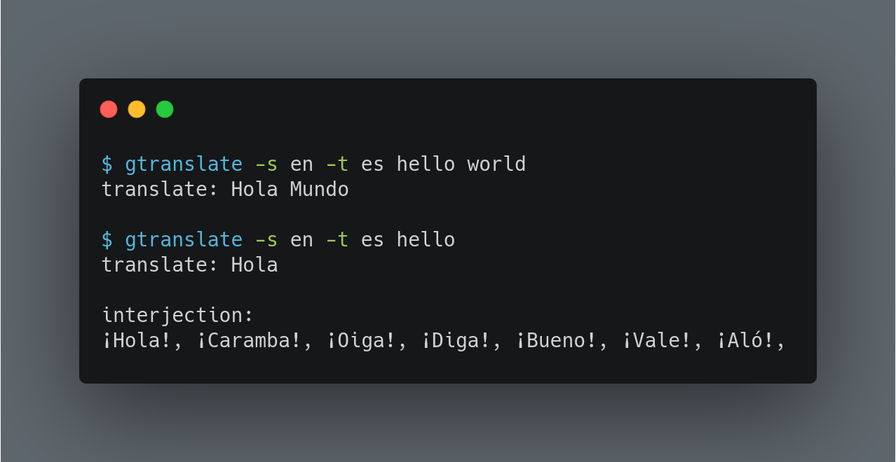

gtranslate - Google translate on command line
===========



gtranslate is a command line tool for translation purpose, written on Rust. using unofficial API from google translate [extension for chrome](https://chrome.google.com/webstore/detail/google-translate/aapbdbdomjkkjkaonfhkkikfgjllcleb?hl=en)

Dependecies
----------------
```
curl = "0.4.44"
serde_json = "1.0"
```
Build
-------
You can download a precompiled binary from [release page](https://github.com/sabitm/gtranslate/releases) or build yourself. you need rustc and cargo installed. it's easier to setup using [rustup](https://rustup.rs/).
```
cargo build --release
```

Usage
--------
```
$ gtranslate
USAGE:
	gtranslate <OPTIONS> <word(s)>

	OPTIONS:
	-s	specify source language
	-t	specify target language
```
```
$ gtranslate -s en -t es hello
translate: Hola

interjection:
¡Hola!, ¡Vale!, ¡Diga!, ¡Bueno!, ¡Caramba!, ¡Oiga!, ¡Aló!,
```
```
$ gtranslate -s es -t en la casa de papel
translate: the paper house
```
it's useful using aliases for translating
```
alias tslen_es='gtranslate -s en -t es'

$ tslen_es hello
```
